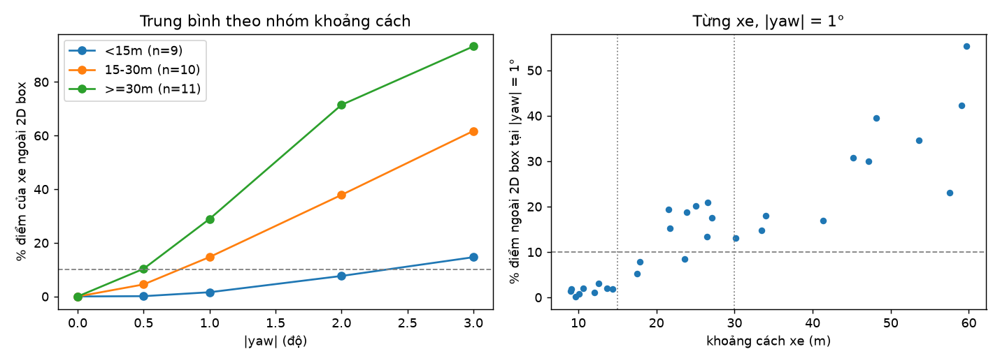
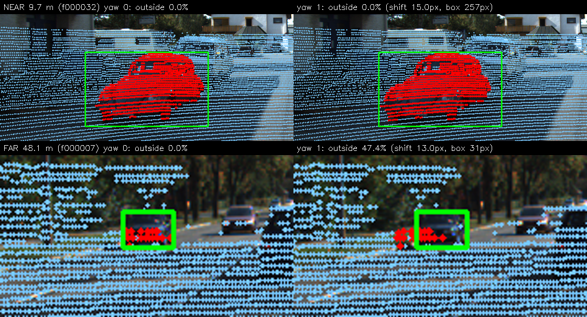

# Báo cáo Day 6: LiDAR–camera projection QA — độ nhạy của overlay với lệch yaw theo khoảng cách

> Thay **mọi** ô có chữ ĐIỀN nằm trong ngoặc vuông bằng nội dung của bạn, xoá luôn cả dấu ngoặc vuông. Lệnh `python tools/check_submission.py` sẽ báo FAIL nếu còn sót bất kỳ chỗ nào.

- **Họ tên:** Đồng Mạnh Hùng
- **MSSV:** 2A202602412 (phải trùng với MSSV trong tên repo `<HoVaTen>-<MSSV>-Track4-Day21`)
- **Lớp:**  AI20K-T4
- **Link repo:** https://github.com/Hung23020370/DongManhHung-2A202602412-Track4-Day21
- **Topic:** A — LiDAR-camera projection QA
- **Dataset:** data/kitti_mini (thí nghiệm chính), data/synthetic (kiểm tra tay hàm chiếu ở CP2)
- **Các frame đã dùng:** kitti_mini: cả 20 frame (000001, 000004, 000007, 000008, 000009, 000010, 000011, 000012, 000015, 000016, 000019, 000021, 000023, 000025, 000031, 000032, 000043, 000048, 000049, 000061) cho thí nghiệm sweep; ảnh overlay demo ở 000025, 000007, 000011. synthetic: 000000

> Hãy viết ngắn: mỗi mục từ 3 đến 8 dòng, ưu tiên số liệu và hình ảnh.

## 1. Claim

Một câu khẳng định kỹ thuật có thể kiểm chứng. Ví dụ: *"Lệch yaw 1° làm 12% điểm LiDAR rơi ra khỏi vật thể ở 30 m, phát hiện được bằng edge-alignment score với ngưỡng X."*

**Claim (nháp, CP1):** Trên 30 xe `Car` không bị che và không bị cắt (`truncated = 0`, `occluded = 0`, có ≥ 10 điểm trong 3D box; ban đầu 33 xe, loại 3 xe quá ít điểm) của `data/kitti_mini`, khi LiDAR lệch yaw 1° so với calibration gốc, hơn 10% điểm LiDAR của xe (điểm nằm trong 3D box GT) chiếu ra ngoài 2D box GT nếu xe cách ≥ 30 m, và tỉ lệ này lớn hơn ít nhất 2 lần so với xe cách < 15 m.

Lý do dự đoán: lệch 1° dịch điểm trên ảnh khoảng f·θ ≈ 12.6 px (f ≈ 720 px), gần như không đổi theo khoảng cách, trong khi bề rộng xe trên ảnh co lại theo 1/d; vì vậy tỉ lệ điểm rơi ra ngoài tăng gần tuyến tính theo d (xấp xỉ d·sin 1° / bề rộng xe).

Sẽ đo: % điểm của xe nằm ngoài 2D box, theo yaw 0°, 0.5°, 1°, 2°, 3° và theo nhóm khoảng cách (< 15 m, 15–30 m, ≥ 30 m). Claim có thể được sửa ở các checkpoint sau.

## 2. Evidence

Bảng hoặc plot số liệu, kèm ảnh/video demo. Ghi rõ đường dẫn file trong `results/`.

Metric: **% điểm của xe (trong 3D box GT) chiếu ra ngoài 2D box GT**, trung bình trên xe, gộp yaw +/−. Yaw 0° cho 0.0% ở cả 3 nhóm (calibration gốc khớp). 30 xe `Car` (truncated = 0, occluded = 0, ≥ 10 điểm) từ 20 frame kitti_mini.

| Nhóm khoảng cách (số xe) | yaw 0.5° | yaw 1° | yaw 2° | yaw 3° |
|---|---|---|---|---|
| < 15 m (9) | 0.1 | **1.6** | 7.7 | 14.7 |
| 15–30 m (10) | 4.5 | **14.7** | 37.9 | 61.7 |
| ≥ 30 m (11) | 10.3 | **28.9** | 71.5 | 93.3 |



Ảnh overlay baseline ở 3 khoảng cách: `results/figures/cp2_overlay_3_distances.png`. Số liệu: `results/yaw_perturb_sweep.csv` (tổng hợp), `results/yaw_perturb_per_object.csv` (từng xe), cấu hình: `results/yaw_perturb_config.json`.

**Kết luận:** claim được ủng hộ. Ở yaw 1°, 11/11 xe ≥ 30 m có hơn 10% điểm rơi ngoài box (thấp nhất 13.1%, trung vị 30.0%), và trung bình xe ≥ 30 m gấp khoảng 18 lần xe < 15 m (28.9% so với 1.6%). Dự đoán hình học ban đầu (≈ d·sin 1° / bề rộng xe) đúng về xu hướng nhưng **quá cao cho xe gần** (dự đoán ~10%, đo được 1.6%): dịch 12.6 px là nhỏ so với box rộng ~195 px của xe gần, nên chỉ điểm sát mép bị đẩy ra. Lưu ý: 3 xe ở ≥ 60 m bị loại vì có dưới 10 điểm trong 3D box; lệch +1° và −1° không đối xứng hoàn toàn (14.9% và 17.0% trên toàn bộ xe).

## 3. Failure case

Nêu khi nào hệ thống hoặc phương pháp fail, vì sao fail, và liên hệ tới lớp nào trong 6 lớp debug: I/O, Geometry, Time, Preprocess, Model, Metric.



**Failure:** kiểm tra "điểm LiDAR có rơi trong 2D box không" **bỏ sót** lệch yaw khi vật ở gần. Cùng lệch 1°, xe 9.7 m (frame 000032, box rộng 257 px) vẫn 0.0% điểm ngoài box dù cả đám điểm đã dịch ~15 px, còn xe 48.1 m (frame 000007, box rộng 31 px) rơi 47.4% điểm ra ngoài. Trên cả 9 xe < 15 m, ở 1° không xe nào vượt 3.1%; ở 2° vẫn 8/9 xe dưới ngưỡng 10%, tức một ngưỡng cố định 10% chỉ dùng xe gần sẽ cho "calibration OK" khi LiDAR đã lệch 2°. Xe ≥ 30 m thì đã lộ ở 0.5° (5/11 xe vượt 10%).

**Vì sao:** lệch góc θ dịch điểm trên ảnh khoảng f·θ ≈ 12–15 px, gần như không phụ thuộc khoảng cách, nhưng box của vật co lại theo 1/d (257 px ở 9.7 m, 31 px ở 48.1 m). Tỉ lệ dịch/bề rộng (5.8% so với 42.1%) mới quyết định điểm có rơi ngoài box hay không. Gốc là **Geometry** (xoay quanh LiDAR cho dịch pixel gần như không đổi theo d); lỗi *bị che giấu* ở lớp **Metric**: % trong box phụ thuộc kích thước vật chứ không đo trực tiếp độ lệch calibration.

**Cách phát hiện / khắc phục khi chạy thật:** (1) báo cáo metric theo nhóm khoảng cách và ưu tiên vật xa hoặc đường chân trời để kiểm tra drift; (2) đo độ lệch bằng pixel hoặc góc (ví dụ khớp cạnh depth với cạnh ảnh) thay vì % trong box; (3) ghi log theo thời gian để thấy xu hướng drift.

## 4. Khuyến nghị nếu triển khai thật

Use-case cụ thể (ADAS / robot / drone), trade-off và bước tiếp theo.

**Use-case:** kiểm tra drift calibration LiDAR–camera định kỳ cho ADAS (xe có LiDAR và camera gắn cố định), chạy trên log lái thật hoặc khi xe vào xưởng.

**Trade-off:** dùng "% điểm trong 2D box" thì đơn giản, không cần model, nhưng độ nhạy phụ thuộc khoảng cách. Ở 1°, xe ≥ 30 m cho 28.9% điểm ngoài box còn xe < 15 m chỉ 1.6%, và ở 2° vẫn có 8/9 xe gần dưới ngưỡng 10%. Vì vậy không nên đặt một ngưỡng chung cho mọi khoảng cách. Đổi lại, nếu chỉ dùng vật xa thì số điểm ít (ví dụ xe 48 m chỉ có 19 điểm) nên kết quả nhiễu và 3 xe ≥ 60 m phải loại.

**Khuyến nghị:** (1) báo cáo metric theo nhóm khoảng cách, cảnh báo dựa trên xe ≥ 30 m với ngưỡng 10% (lộ lệch từ khoảng 0.5°–1°); (2) song song đo độ lệch bằng pixel hoặc góc (khớp cạnh depth với cạnh ảnh) vì không phụ thuộc kích thước vật; (3) ghi log theo thời gian để thấy drift tăng dần.

**Bước tiếp theo:** kiểm chứng trên nhiều frame hơn (kitti_mini chỉ có 30 xe), thêm lệch pitch/roll và lệch thời gian, và chọn ngưỡng cảnh báo dựa trên dữ liệu thật của xe.

## 5. Cách chạy lại

Các lệnh tái tạo lại toàn bộ kết quả từ repo sạch.

```bash
# CP2: test tay + ảnh overlay 3 khoảng cách (gần/vừa/xa)
python -m src.cp2_demo
# CP3: sweep yaw (xác định, không ngẫu nhiên) -> results/yaw_perturb_*.csv + figures/yaw_sweep_outside_pct.png
python -m src.yaw_sweep
# CP4: ảnh failure case (cần chạy sau yaw_sweep vì đọc results/yaw_perturb_per_object.csv)
python -m src.failure_case
# Overlay đầy đủ từng frame bằng CLI của starter
python -m starter.projection --data-root data/kitti_mini --frame 000025
python -m starter.projection --data-root data/kitti_mini --frame 000011
python -m starter.projection --data-root data/kitti_mini --frame 000007
```

## 6. Khai báo sử dụng AI

Ghi rõ đã dùng công cụ AI nào, dùng vào việc gì, và bạn đã tự kiểm chứng kết quả đó bằng cách nào. Nếu không dùng AI, ghi "Không sử dụng". Xem quy định ở `RULES.md` mục 2.

| Công cụ | Dùng cho việc gì | Bạn đã kiểm chứng thế nào |
|---|---|---|
| Claude (Anthropic) | Hỗ trợ viết và giải thích `src/yaw_sweep.py`, `src/failure_case.py`; soạn nháp REPORT | Tự chạy lại `python -m src.yaw_sweep` hai lần, các file CSV có md5 trùng nhau; đối chiếu bảng mục 2 và các số ở mục 3 với `yaw_perturb_per_object.csv`; kiểm tra tay hàm chiếu trên `data/synthetic` (CP2); đọc lại `points_in_box3d` và `outside_pct` để giải thích được code |